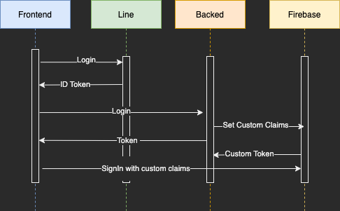

# วิธีการทำงาน อ่านด้วยนะครับ :>

[](https://github.com/MeowmeowGangster/FlashCardBackend/actions/workflows/deploy.yaml)

1 . Clone Git หรือใช้ Github Desktop ก็ได้

```bash
git clone  https://github.com/MeowmeowGangster/FlashCardBackend.git
```

2 . สร้าง Branch ใหม่

```bash
git checkout -b ชื่อ/feature
เช่น git checkout -b  pattanunNP/deck-api
```

3 . Install Package

```bash
npm install หรือ yarn
```

4 . สร้างไฟล์ `.env` ในโฟลเดอร์ root แล้วใส่ข้อมูลตาม `.env.example`
ให้มาขอ .env จากอาร์ม เพราะมีข้อมูลที่เป็นความลับอยู่  เดี๋ยวโดนโจมตี

5 . Run Project

```bash
npm run dev หรือ yarn dev
```

6 . เข้าไปที่ <http://localhost:8080>

7 . ทำงานใน Branch ที่สร้างไว้

8 . เมื่อเสร็จแล้ว ให้ Commit และ Push ไปที่ Branch ที่สร้างไว้

```bash
git add .   
git commit -m "เขียนอะไรก็ได้ แต่ต้องเขียนเป็นภาษาอังกฤษ ให้เข้าใจง่าย ว่าทำอะไรไปบ้าง"   
git push origin ชื่อ/feature

เช่น git push origin  pattanunNP/deck-api
```

9 . ไปที่ Github แล้วกด Pull Request ขอ Merge ไปที่ Branch Develop
เลือก Reviewer ให้เป็นอาร์ม และเลือก Assignee ให้เป็นตัวเอง แล้วกด Create Pull Request
ไปทำอะไรอื่นก่อน อาร์มจะมา Review ให้ แล้วก็ Merge ให้

# Firebase ID Token

เป็น Token มีอายุ 1 ชั่วโมง ได้มาจากการนำ Token จาก Line มาแลก ที่ใช้ในการตรวจสอบว่าผู้ใช้งานเป็นคนที่มีสิทธิ์ใช้งานหรือไม่
เมื่อหมด 1 ช.ม. ให้ทำการ Login ใหม่


